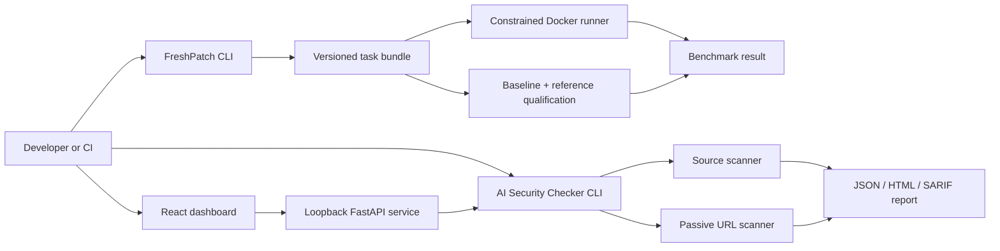

# Architecture

Patchwork is a Python monorepo with an optional TypeScript interface. The CLIs
remain independently usable when the dashboard is not installed or running.

## Boundaries

- `freshpatch` owns task construction, validation, execution, and aggregation.
- `aisec` owns security rules, target acquisition, findings, and report formats.
- `patchwork_api` is an adapter. It restricts local filesystem access to a
  configured root and does not weaken URL scanner safety controls.
- `apps/dashboard` renders reports and initiates bounded scans. It contains no
  provider credentials and does not call model APIs from the browser.

## Data model

Security findings use stable rule IDs and carry severity, confidence, location,
evidence, impact, and remediation. A scan report contains target metadata,
scanner metadata, summary counts, and findings.

FreshPatch task manifests record schema version, repository provenance, base
and fix commits, test command, changed paths, reference-patch checksum, immutable
runner image, and isolation/resource policy. Qualification artifacts prove the
buggy baseline fails and the reference patch passes under one environment.
Evaluation results record that effective environment and separate passing tests,
failing tests, timeouts, and evaluator errors so downstream analyses can choose
and disclose an appropriate denominator.
