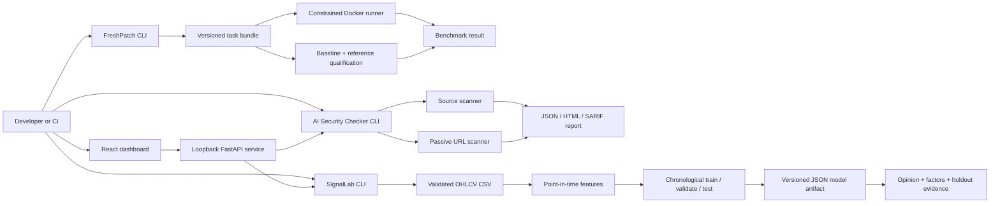

# Architecture

Patchwork is a Python monorepo with an optional TypeScript interface. The CLIs
remain independently usable when the dashboard is not installed or running.

## Boundaries

- `freshpatch` owns task construction, validation, execution, and aggregation.
- `aisec` owns security rules, target acquisition, findings, and report formats.
- `signallab` owns bounded market-data validation, point-in-time features,
  leakage-resistant training, strict JSON model artifacts, and research opinions.
- `patchwork_api` is an adapter. It restricts local filesystem access to a
  configured root, does not weaken URL scanner safety controls, and delegates
  CPU-bound model work through the same bounded concurrency boundary.
- `apps/dashboard` renders reports and research evidence, then initiates bounded
  scans or analyses. It contains no provider credentials and does not call
  third-party model or market-data APIs from the browser.

## Data model

Security findings use stable rule IDs and carry severity, confidence, location,
evidence, impact, and remediation. A scan report contains target metadata,
scanner metadata, summary counts, and findings.

FreshPatch task manifests record schema version, repository provenance, base
and fix commits, test command, changed paths, reference-patch checksum, immutable
runner image, and isolation/resource policy. Qualification artifacts prove the
buggy baseline fails and the reference patch passes under one environment.
Evaluation results record that effective environment and separate passing tests,
failing tests, timeouts, and evaluator errors so downstream analyses can choose
and disclose an appropriate denominator.

SignalLab consumes a strict long-format daily OHLCV table. Features use only
information available on the row date; labels compare the stock's future return
with the benchmark's future return over the configured horizon. Chronological
train, validation, and test periods purge labels whose endpoints overlap the
next period. Preprocessing and model parameters are fitted on training data,
ensemble blending and probability calibration use validation data, and the test
period is reserved for final metrics and a conservative presentation gate. Raw
forward-label rows overlap, so SignalLab also records a horizon-aware effective
window count rather than treating every row as independent evidence.

The model artifact is non-executable JSON with a schema and feature version,
data SHA-256, training cutoff, split boundaries, feature statistics, model
parameters, validation and test metrics, and training symbols. An opinion adds
the as-of date, horizon, calibrated outperform probability, qualitative label,
heuristic evidence strength, one-feature perturbation evidence, limitations, and
a research-only disclaimer. The label summarizes a probabilistic model result;
it is not a personalized investment recommendation.
